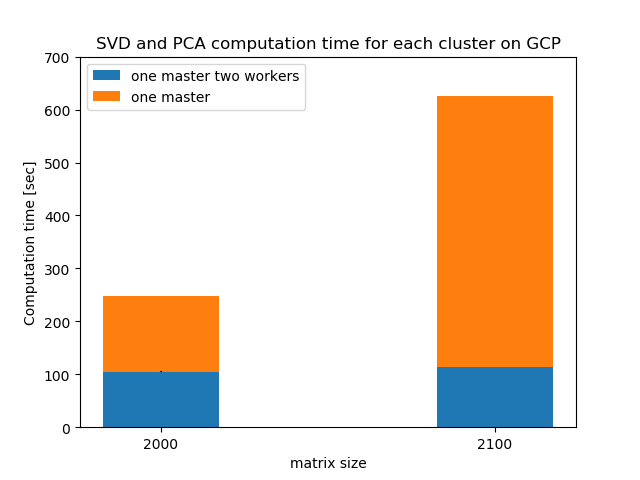
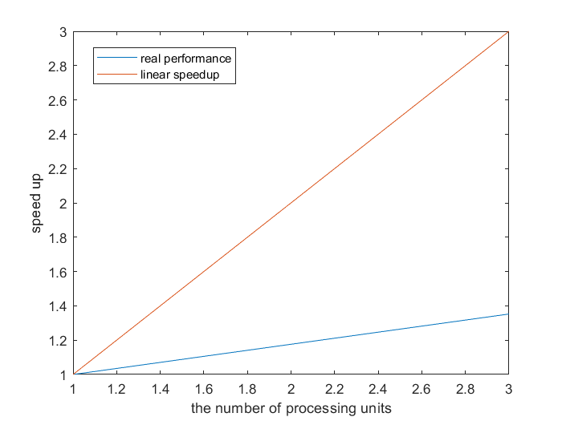
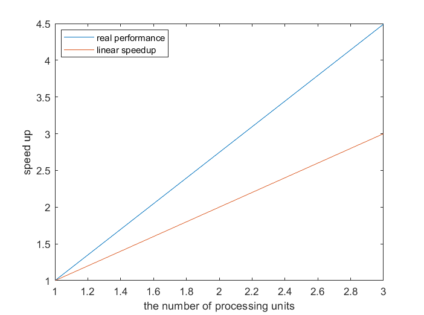

# Assignment3--Spark-on-gcp
This report is to test the computations of SVD and PCA on the matrix evaluated by pyspark on google cloud.

**set-up.**
Throughtout this report, the dense square matrices are randomly generated by normal distribution with zero mean and unit variance. In addition, we use `RowMatrix` to distributed the matrix partitions among the machines within the cluster. Then, we use SVD and PCA computations available in `pyspark` to evaluate their performance among two different clusters.

## Requirements

This section introduces the requirements so that pyspark can be run on your personal local machine as shown below: 

* Java JDK
* Scala
* Spark 2.3.3 with Hadoop 2.7 
* Anaconda 3 with the following installed package `numpy` 

In addition, you have to export SPARK_HOME (for your current spark directory), PYSPARK_PYTHON (for your current python directory), and HADOOP_HOME (for your current hadoop directory) to be able to run the python scipt on spark. 

## Run the code in the personal Windows machine 

After all the installations, we can run the SVD and PCA computations by the python scipt `Spark-test-svd-and-pca.py` on your personal machine with spark 2.3.3 and hadoop 2.7 by using the following command:

`directory/to/spark-2.3.3-bin-hadoop2.7/bin/spark-submit Spark-test-svd-and-pca.py`

## Run the code on GCP

This section introduces how to test the SVD and PCA computations by the script `Spark-test-svd-and-pca.py` on GCP. We follow the detailed steps which can be found in [the following site](https://towardsdatascience.com/step-by-step-tutorial-pyspark-sentiment-analysis-on-google-dataproc-fef9bef46468).

To be able to run the python scripts on top of spark in the google cloud platform, we need to 

1. Enable Cloud Dataproc API which can be found in the API library in your console. 

2. Create the Bucket which can be found in Web Console. Here, you upload necessary python scipts and data matrices. 

3. Create the clusters to make the numerical evaluations using Dataproc. Here, you can easily deploy the clusters which are already installed spark and python. 

4. You can submit the job into the cluster easily from your console.

## Numerical Results for GCP

We randomly generated the dense matrix with dimension $2000\times2000$, $2100\times 2100$, and $2200\times 2200$ to evaluate the performance of distributed computations of SVD and PCA when we use two different types of clusters: one consists of one master and another consists of one master and two workers. Throughout the simulations, we set 2 virtual CPUs and 500 GB memory storage for a master and each worker.  

 

| Cluster type | Matrix Dimension | Running Time |
| ------------- |:-------------:| -----:|
| 1 M 0 W | $2000\times2000$  | 2 min 22 sec |
| | $2100\times2100$| 8 min 32 sec |
| |$2200\times2200$ | out of memory |
| 1 M 2 W | $2000\times2000$  | 1 min 45 sec |
| | $2100\times2100$| 1 min 54 sec |
| |$2200\times2200$ | 2 min 0 sec |

The table and figure illustrate that the cluster with high number of workers outperforms that with low number of workers in terms of computation time when we increase the matrix size gradually. Also, if the matrix size is not high enough, then the compuation time between these clusters can be comparable. In addition, we can see the sub-linear speedup and faster-than-linear speedup when the benchmarking matrices with size $2000\times 2000$  and $2100\times 2100$ are used. Here, the relative speedup of the algorithm on $p$ processors is defined as $S(p) = t_1/t_p$ , where $t_1$ and $t_p$ are the time it takes to finish the compuations on $1$ and $p$ processing units, respectively.

$2000\times 2000$             |  $2100\times2100$
:-------------------------:|:-------------------------:
 |  

## Github respository 

All the results and python scripts can be found in the following link: 
https://github.com/KhiriratSarit/-Assignment3--Spark-on-gcp